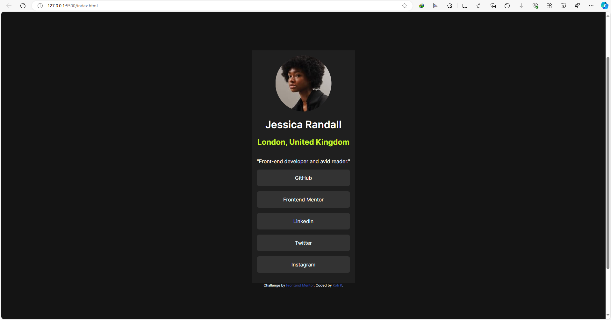
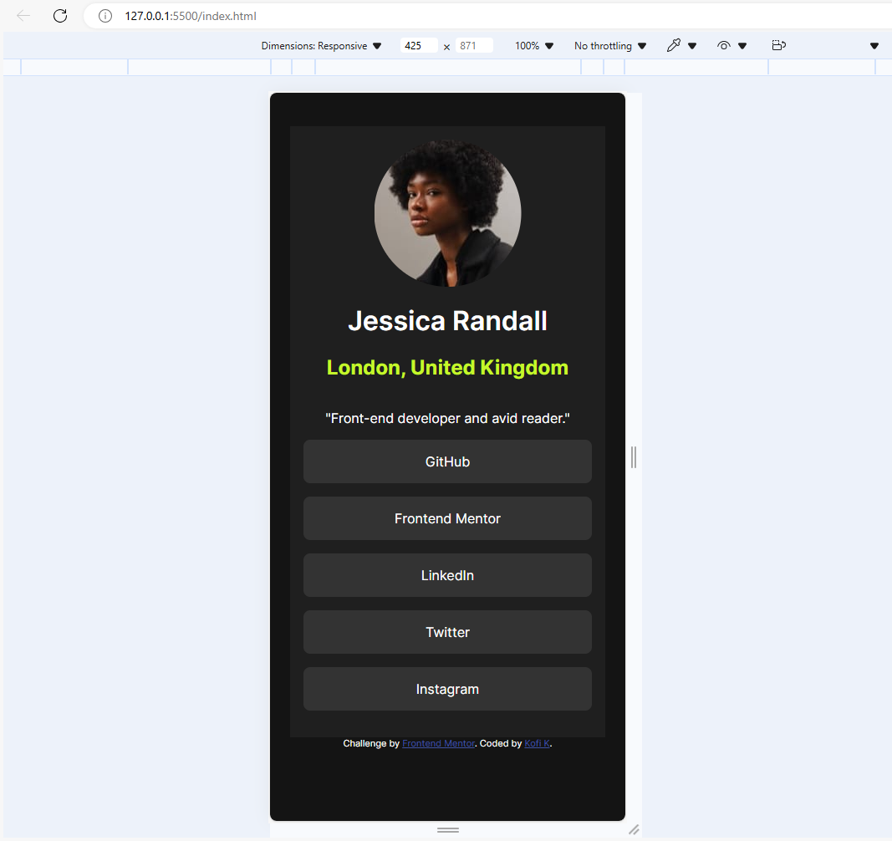
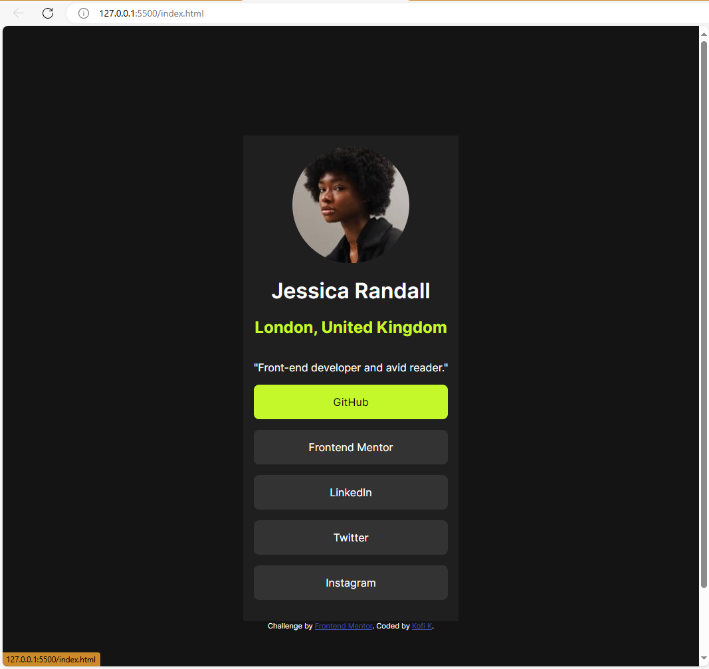

# Frontend Mentor - Social links profile solution

This is a solution to the [Social links profile challenge on Frontend Mentor](https://www.frontendmentor.io/challenges/social-links-profile-UG32l9m6dQ). Frontend Mentor challenges help you improve your coding skills by building realistic projects. 

## Table of contents

- [Overview](#overview)
  - [The challenge](#the-challenge)
  - [Screenshot](#screenshot)
  - [Links](#links)
- [My process](#my-process)
  - [Built with](#built-with)
  - [What I learned](#what-i-learned)
  - [Continued development](#continued-development)
  - [Useful resources](#useful-resources)
- [Author](#author)
- [Acknowledgments](#acknowledgments)


## Overview

### The challenge

Users should be able to:

- See hover and focus states for all interactive elements on the page

### Screenshot



This is how it looks like on Desktop.



This is how it looks like on Mobile.



This is one of the link's hover state when you place the mouse pointer on top of it.

### Links

- Solution URL: [Add solution URL here](https://your-solution-url.com)
- Live Site URL: [Add live site URL here](https://your-live-site-url.com)

## My process

### Built with
- VS Code(Visual Studio Code)
- Semantic HTML5 markup
- CSS custom properties
- Flexbox
- CSS Grid


### What I learned

Use this section to recap over some of your major learnings while working through this project. Writing these out and providing code samples of areas you want to highlight is a great way to reinforce your own knowledge.

For this challenge,I revised on how to systematically program the webpage to life and also used my knowledge on Flexbox and Grid in order to reposition the main content of the webpage. It was tricky ngl.

Also,using the previous challenge I did(Recipe Webpage),I tried out the BEM naming convection.

This is a snippet of what I did.

```css
/* mainContent of the webpage goes here. */
.mainContent{
    background-color: var(--Grey800);
    width: max-content;
    padding: 1rem;
    display: flex;
    flex-direction: column;
    align-items: center;
}
/* This is meant to be the h1 header for the mainContent */
.mainContent__h1--FWeight600{
    /* margin-bottom: 0rem; */
    font-weight: var(--FWeight600);
}

/* And this is meant for the h2 header of the mainContent */
.mainContent__h2{
    margin-top: 0rem;
    color: var(--Green);
    font-weight: var(--FWeight700);
    /* margin-bottom: 0rem; */
}

/* This class is  meant to contain the links to be displayed.  */
.linksContainer{
    display: flex;
    flex-direction: column;
    width: 100%;

}
/* This class is for each link in the linksContainer div. */
.linksContainer__links{
    
    background-color: var(--Grey700);
    width: 100%;
    
    margin: auto auto 1rem auto;
    border-radius: .5rem;
}

```


### Continued development

Hm..i think i'll continue practising on how to make responsive layouts using flexbox and grid in order to be better.i'll also be learning how to structure webpages so that it would be easily accessible.

### Useful resources

- [GetBEM.com](https://getbem.com/introduction/) - This helped me to understand how BEM works.


## Author

<!-- - Website - [Add your name here](https://www.your-site.com) -->
- Frontend Mentor - [@Kofi100](https://www.frontendmentor.io/profile/Kofi100)
<!-- - Twitter - [@yourusername](https://www.twitter.com/yourusername) -->


<!-- ## Acknowledgments

This is where you can give a hat tip to anyone who helped you out on this project. Perhaps you worked in a team or got some inspiration from someone else's solution. This is the perfect place to give them some credit.

**Note: Delete this note and edit this section's content as necessary. If you completed this challenge by yourself, feel free to delete this section entirely.** -->
